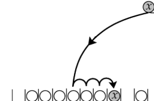

# learning_data_structure
A public repo to save my answers in Dr. Mustafa Saad course it about 123 problem 
the course was fulled with recursice functions (tahnks Dr. Mustafa for your effort)
> Think in the problem then think how to solve

The system is slow mmm? why it slow (go deep)? then think about the solution.

## Arrays
We have learned the array and know how it was lemeted and how to make it with fixed elements as c++
```python
store = Array(6)
```
***Note:*** arrays are so bad if you will delete from the start as it will take O(n), on the other hand in SLL it will take O(1)
But it you will delete for the tail in the array will take only O(1) and in SLL O(n)
if you will use index the array will be the better choice

### Size vs Capacity
the size is what the user expected and the capacity is how the array acculy size in the backend 
<br>
we can use it to make only expantion when the size is == the capcaity
so we will execute the expantion in some small steps only 
<br>
lecture: https://www.udemy.com/course/python-ds-skills/learn/lecture/29805120

we have solved about 7 problems

---
## Complexity 
we have learned the complexity and how to calculate it
<br>
we have learned the time measure and the memory measure

> ```str += "new str"``` is O(n)
>  ```arr[1000]``` is O(1)


## SLL (single Linkend List)
There are only to way to store data:
### Physical Data structure:
it is the base of storing data that you will use in the more complex datastructure as heap or BST
<br>
There are only two types of storing data:
- ***Blocks***  as in array

- ***Scattered***  as linked list (node->node)


### Logical Data Structure 
is the high level of the ***physical datastructure***, you build it base in some logic as ```Stack``` or ```Queuee```
### Memory Locality
CPU has L1/2/3 small memories it cash some data here to make it easy to back to it ... there are some more details 
#### Stack Vs Heap

***Contigus array***: No gaps between elemnts

***Non Contigus array***: The elemnts are not continus


---

## Heap 
there is (***min***/max) binary heap
<br>
the search is O(H) (H-> height)
<br>
insert and remove element is O(logn)
<br>
to get the min O(1) is the pearent 
<br>
Given N random elements we need O(NlogN) to build BST with them but can do it in O(N) for a heap
<br>
The logic: The parent is smaller than or equal all the shild 

we make the physucal storage as array and as this [2, 6, 8, 14, 7, ...]

and we have two formala to get the 2 childs for the parent and a formal to get the parent of the childs 


---

## Trie 
it is used to store strings in a very effitiont way but it has some storage wast
we have leanrd how to make the autocomplete in very fast way and to check prefix suffix in very effitiont way


---

## Hash Tables
Hash metods make diffrent hash number with every run, but you can make it return the same number with every run; it is a logic in python

Note: when use ```__hash__``` you should use ```__eq__```

### Hash table
the base idea -> string to a number the problem is many collisions


### Chainig DataStructure 


### Binary Probing 


### Load factor
is the most important number that points to the perforamnce of the datastructure (more smaller number is more effetiont)
- c# load factor is 1
- Java Load factor is 0.75
every language use the rahsing to inprove its Load factor

### Rehashing 
is the * the size of the array then rehash the elemts on it. it will make the elemts spread along the chainig not focus in one chain 
